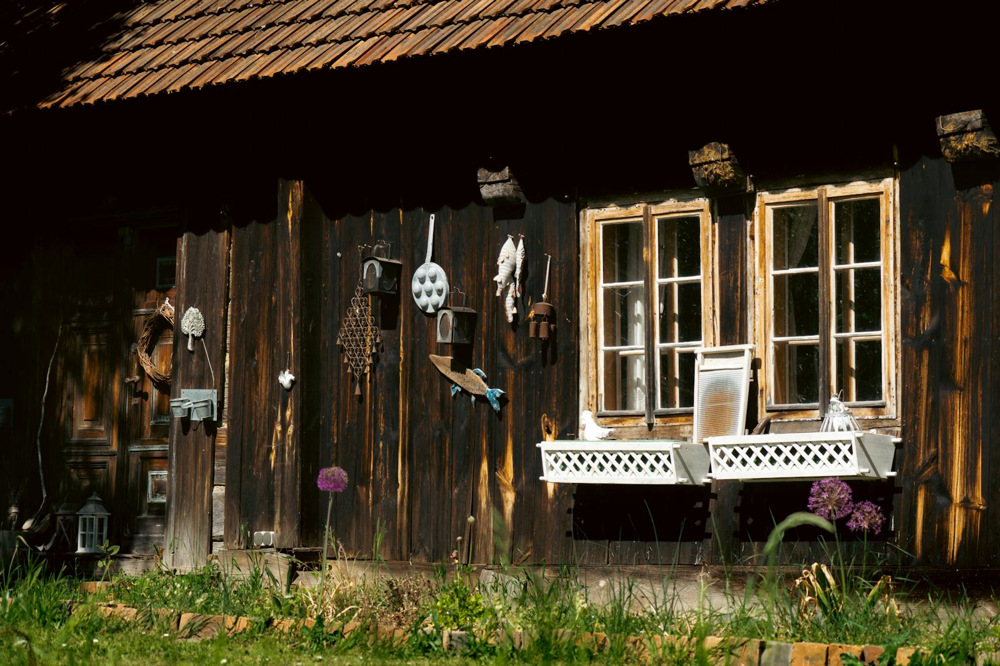
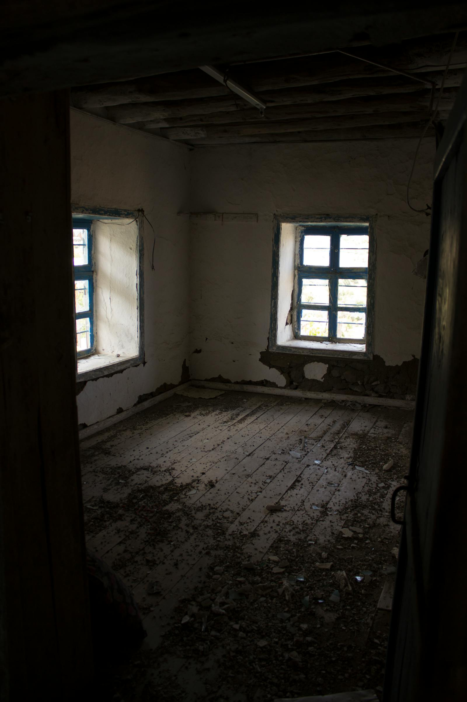
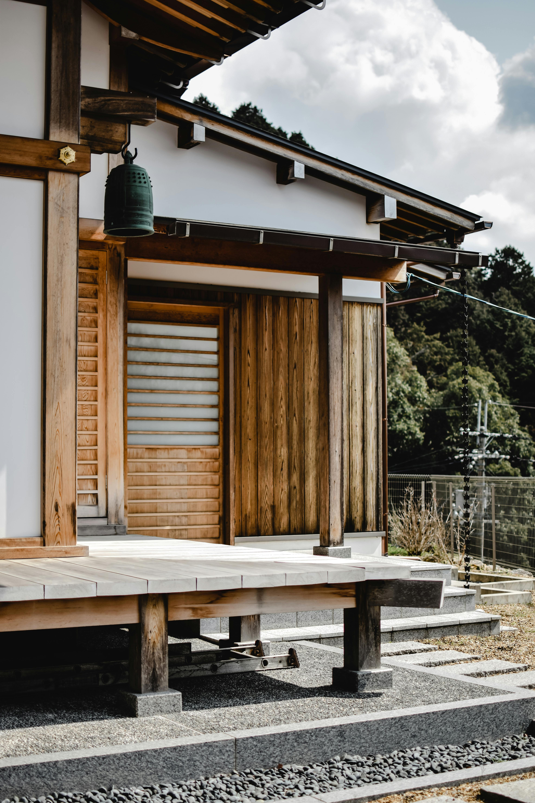
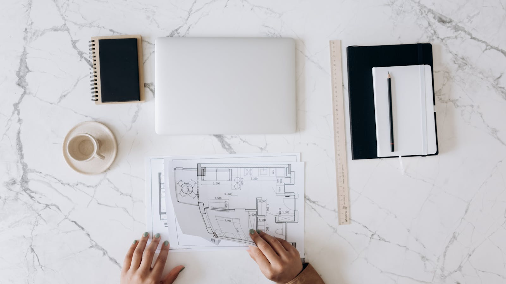
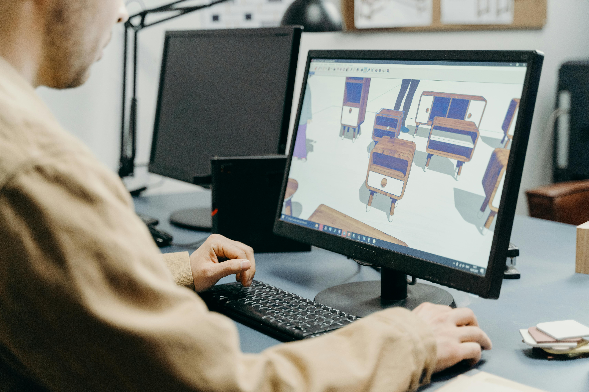
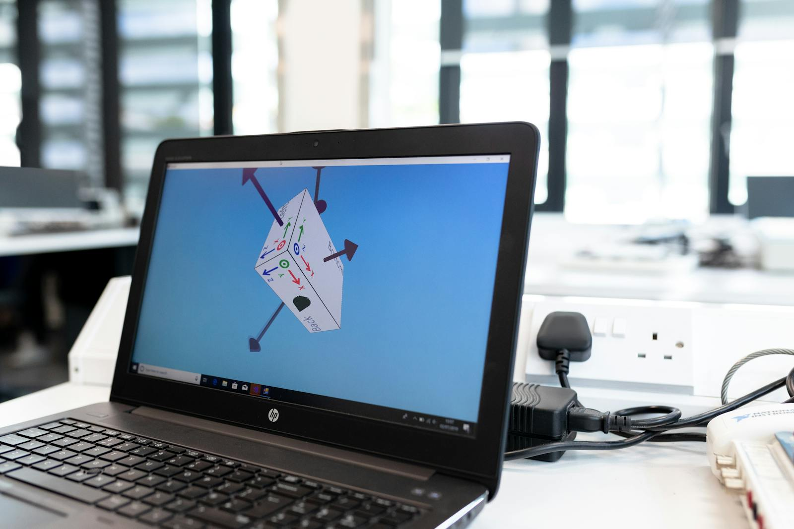
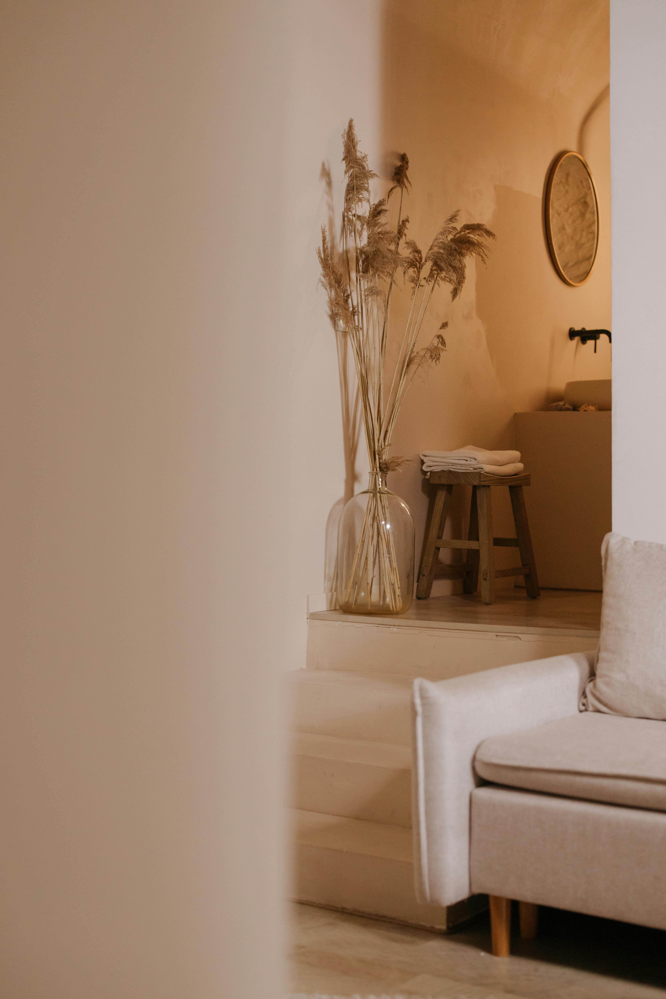
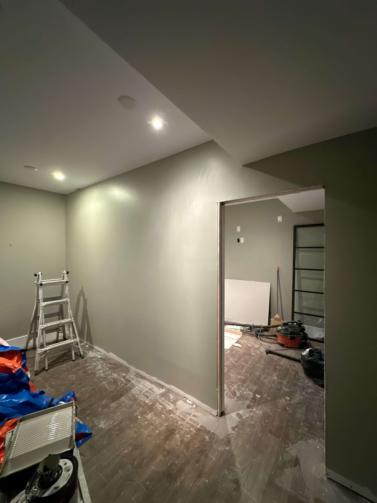
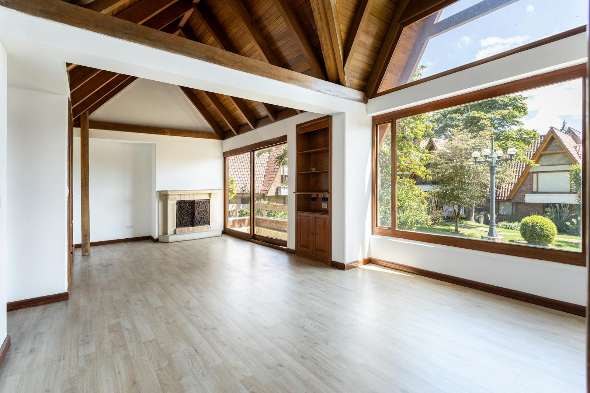

  

    <h3>document overview</h3>
    <h1>空き家3Dリフォーム可視化サービス</h1>
    

      
3Dスキャンを土台にして、古い内装だけでは伝わらない物件の可能性を、同一視点の改修イメージとして見せる。

      
対象は離島の空き家。意思決定を助けるための Web サービスとして設計する。

    

    

      
3D scan

      
local AI

      
before / after

    

  

  

    
    
Image URL: https://images.pexels.com/photos/24205802/pexels-photo-24205802.jpeg?auto=compress&amp;cs=tinysrgb&amp;w=1600

  

---

  

    
    
Image URL: https://images.pexels.com/photos/8222953/pexels-photo-8222953.jpeg?auto=compress&amp;cs=tinysrgb&amp;w=1600

  

  

    <h3>problem and purpose</h3>
    <h2>現況だけでは、候補から外れやすい</h2>
    <ul>
      <li>古さや汚れで魅力が過小評価される</li>
      <li>内見前だと暮らしを想像しにくい</li>
      <li>関係者間で改修イメージを共有しづらい</li>
    </ul>
    
このギャップを埋めるのが本サービスの目的。

  

---

  

    
    
Image URL: https://images.pexels.com/photos/6226120/pexels-photo-6226120.jpeg?cs=srgb&amp;dl=pexels-eva-bronzini-6226120.jpg&amp;fm=jpg

  

  

    <h3>users and value</h3>
    <h2>主な利用者は 5者</h2>
    <ul>
      <li>移住希望者: 候補の絞り込みをしやすくする</li>
      <li>所有者: 物件の見せ方を改善する</li>
      <li>自治体 / 不動産 / 施工事業者: 相談の土台を共有する</li>
    </ul>
    
価値の中心は、同一視点での比較と、自然言語による改修指示。

  

---

  

    
    
Image URL: https://images.pexels.com/photos/6894105/pexels-photo-6894105.jpeg?auto=compress&amp;cs=tinysrgb&amp;w=1600

  

  

    <h3>scope</h3>
    <h2>やることと、やらないことを先に切る</h2>
    

      

        
<strong>対象範囲</strong>

        <ul>
          <li><code>.glb</code> 表示</li>
          <li>視点 / 深度 / 座標取得</li>
          <li>編集範囲指定</li>
          <li>ローカルAI画像編集</li>
          <li>保存と再表示</li>
        </ul>
      

      

        
<strong>対象外</strong>

        <ul>
          <li>構造安全性の保証</li>
          <li>自動見積もり</li>
          <li>自由視点の完全整合生成</li>
          <li>建築判断の自動化</li>
        </ul>
      

    

  

---

  

    
    
Image URL: https://images.pexels.com/photos/7504746/pexels-photo-7504746.jpeg?cs=srgb&amp;dl=pexels-cottonbro-7504746.jpg&amp;fm=jpg

  

  

    <h3>use case</h3>
    <h2>体験は 8 ステップで定義する</h2>
    <ol>
      <li>3Dスキャンして <code>.glb</code> を作る</li>
      <li>Web上で物件を表示する</li>
      <li>見たい視点を決める</li>
      <li>カラー / 深度 / カメラ行列を取る</li>
      <li>自然言語で改修要望を書く</li>
      <li>必要ならマスク指定する</li>
      <li>ローカルAIで改修後画像を生成する</li>
      <li>比較し、物件データに保存する</li>
    </ol>
  

---

  

    
    
Image URL: https://images.pexels.com/photos/3913016/pexels-photo-3913016.jpeg?auto=compress&amp;cs=tinysrgb&amp;w=1600

  

  

    <h3>functional requirements</h3>
    <h2>機能要件は 4 ブロックで捉える</h2>
    <ul>
      <li>物件管理: 物件 / 部屋 / 結果の管理</li>
      <li>3Dビューア: 表示、回転、ズーム、平行移動、視点取得</li>
      <li>編集指定: プロンプト、マスク、スタイル選択</li>
      <li>生成と表示: ローカル生成、条件保存、Before / After 比較</li>
    </ul>
    
詳細実装は章に分けるが、スライドではカテゴリ単位で見せる。

  

---

  

    
    
Image URL: https://images.pexels.com/photos/5476052/pexels-photo-5476052.jpeg?cs=srgb&amp;dl=pexels-lezginepik-5476052.jpg&amp;fm=jpg

  

  

    <h3>non-functional and data</h3>
    <h2>非機能要件は、再現性と説明責任が中心</h2>
    <ul>
      <li>主要処理は利用者PC上で動作可能</li>
      <li>3Dビュー操作は実用速度を確保</li>
      <li>モデル、seed、prompt、視点情報を保存</li>
      <li>AI生成であり施工保証ではないことを明示</li>
    </ul>
    
保存データは <code>property_id</code>、<code>view_id</code>、画像群、カメラJSON、生成条件、出力画像、作成時刻を最低限保持。

  

---

  

    
    
Image URL: https://images.pexels.com/photos/34135038/pexels-photo-34135038.jpeg?auto=compress&amp;cs=tinysrgb&amp;w=1600

  

  

    <h3>architecture</h3>
    <h2>構成は疎結合に分ける</h2>
    <ul>
      <li>フロントエンド: Three.js による 3D ビューアと操作UI</li>
      <li>ローカル生成基盤: ComfyUI を第一候補に利用</li>
      <li>データ保存: 画像、JSON、生成条件を物件単位で保存</li>
      <li>将来拡張: API連携、再投影表示、視点補間</li>
    </ul>
  

---

  

    
    
Image URL: https://images.pexels.com/photos/7407956/pexels-photo-7407956.jpeg?cs=srgb&amp;dl=pexels-cottonbro-7407956.jpg&amp;fm=jpg

  

  

    <h3>mvp</h3>
    <h2>初期リリースは単一視点に絞る</h2>
    <ol>
      <li><code>.glb</code> の表示</li>
      <li>視点キャプチャ</li>
      <li>深度画像出力</li>
      <li>カメラJSON保存</li>
      <li>world position 取得</li>
      <li>マスク指定</li>
      <li>単一視点での画像生成</li>
      <li>Before / After 比較表示</li>
    </ol>
  

---

  

    
    
Image URL: https://images.pexels.com/photos/19503382/pexels-photo-19503382.jpeg?cs=srgb&amp;dl=pexels-enrique-19503382.jpg&amp;fm=jpg

  

  

    <h3>constraints and risks</h3>
    <h2>制約を隠さず、先に明示する</h2>
    <ul>
      <li>建築的妥当性や構造安全性は保証しない</li>
      <li>構造変更の表現は初期対象外</li>
      <li>品質は3Dモデル、深度、マスク精度に依存する</li>
      <li>無料 / ローカル前提のため GPU 性能に依存する</li>
      <li>過度な美化や視点不整合のリスクがある</li>
    </ul>
  

---

  

    
    
Image URL: https://images.pexels.com/photos/10981670/pexels-photo-10981670.jpeg?auto=compress&amp;cs=tinysrgb&amp;w=1600

  

  

    <h3>success</h3>
    <h2>評価軸は、使われたかどうか</h2>
    <ul>
      <li>物件イメージを持ちやすくなったという回答率</li>
      <li>問い合わせ率、内見予約率の改善</li>
      <li>閲覧時間の増加</li>
      <li>Before / After 比較機能の利用率</li>
    </ul>
    
次の拡張候補は、面認識、家具提案、複数視点整合、再投影表示、管理画面。

  

