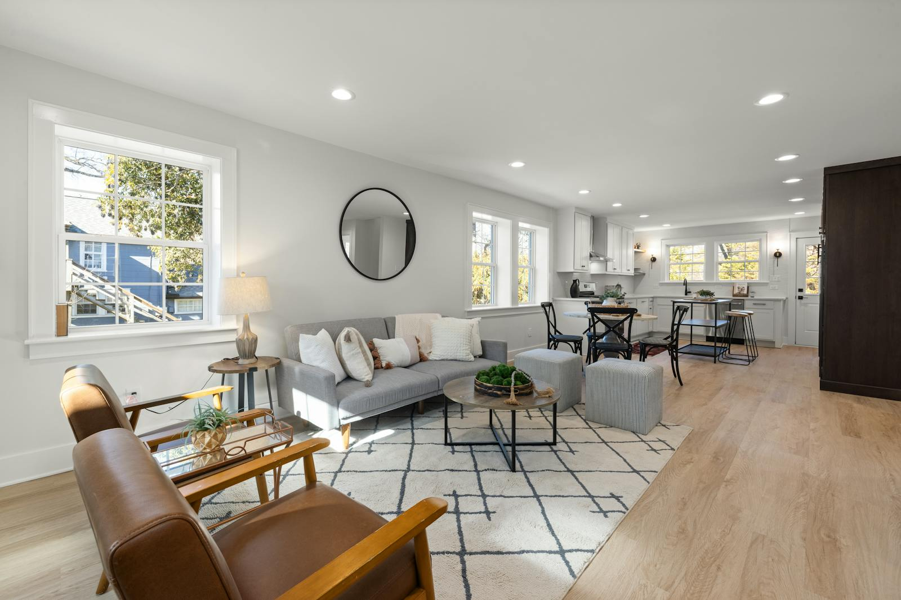

    <h1>空き家リフォーム ワークフロー</h1>

---

  

    <h2>目次</h2>
    <h1>目次</h1>
  

  

    

      

        <b>01</b>
        
導入

        
背景と目的

      

      

        <b>02</b>
        
本論

        
ワークフロー

      

      

        <b>03</b>
        
本論

        
システム構成と出力

      

      

        <b>04</b>
        
結論

        
まとめと今後

      

    

  

---

  

    <h2>導入</h2>
    <h1>背景と目的</h1>
  

  

    

      

        <h3>背景</h3>
        <ul>
          <li>空き家改修の初期提案は、言葉や参考画像に依存しやすい。</li>
          <li>関係者ごとに完成イメージがズレやすい。</li>
          <li>設計前の段階では、比較材料が不足しやすい。</li>
        </ul>
        <h3 style="margin-top:18px;">目的</h3>
        <ul>
          <li>実空間を起点に、同一視点で改修案を比較できるようにする。</li>
          <li>提案初期の意思決定を速くする。</li>
        </ul>
        <blockquote>画像を上から貼り付けて見せる提案支援の仕組みとして位置づける。</blockquote>
      

      

        
      

    

  

---

  

    <h2>本論</h2>
    <h1>ワークフロー</h1>
  

  

    

      

        
STEP 01

        <strong>3Dスキャン</strong>
        
現地空間を取得し、<code>.glb</code> として扱える状態へ整える。

      

      

        
STEP 02

        <strong>視点を固定</strong>
        
部屋、視点、対象エリアを決めて、比較の前提を作る。

      

      

        
STEP 03

        <strong>条件を入力</strong>
        
テイスト、素材、色、用途などの条件を設定する。

      

    

    

    

      

        
STEP 04

        <strong>テクスチャ貼り付け</strong>
        
上からテクスチャを重ね、改修後の見え方を作る。

      

      

        
STEP 05

        <strong>比較する</strong>
        
元空間と合成結果を比べて方向性を確認する。

      

      

        
STEP 06

        <strong>次に進む</strong>
        
レビュー後、設計・見積・提案資料へつなぐ。

      

    

    <blockquote>中心の流れは、視点固定 → 条件入力 → テクスチャ貼り付け → 比較 である。</blockquote>
  

---

  

    <h2>本論</h2>
    <h1>システム構成</h1>
  

  

    

      

        
        

          <strong>ベース空間</strong>
          
部屋と視点を選び、比較の前提となる見え方を固定する。

        

      

      

        
        

          <strong>テクスチャ</strong>
          
上から貼る素材やパターンを用意して方向性を決める。

        

      

      

        
        

          <strong>テクスチャ合成</strong>
          
テクスチャを上から重ねた見え方を表示し、比較表示へ渡す。

        

      

    

    <blockquote>ビューアは「何をどこから見るか」、合成側は「どう見せるか」を担当する。</blockquote>
  

---

  

    <h2>本論</h2>
    <h1>出力の見せ方</h1>
  

  

    

      <figure>
        
        <figcaption>Before</figcaption>
      </figure>
      <figure>
        
        <figcaption>After</figcaption>
      </figure>
    

    <blockquote>出力は完成図ではなく、比較と判断のための材料として扱う。</blockquote>
  

---

  

    <h2>本論</h2>
    <h1>評価と制約</h1>
  

  

    

      

        <strong>評価の観点</strong>
        <ul>
          <li>同一視点で比較できるか</li>
          <li>入力条件に沿っているか</li>
          <li>意思決定に使えるか</li>
        </ul>
      

      

        <strong>技術的な制約</strong>
        <ul>
          <li>スキャン精度に依存する</li>
          <li>GPU性能で速度が変わる</li>
          <li>自由視点の整合性はMVP外</li>
        </ul>
      

      

        <strong>運用上の注意</strong>
        <ul>
          <li>施工可能性は保証しない</li>
          <li>著作権や利用条件に注意</li>
          <li>レビュー基準を明確にする</li>
        </ul>
      

    

  

---

  

    <h2>結論</h2>
    <h1>まとめ</h1>
  

  

    

      

        <h3>要点</h3>
        <ul>
          <li>3D空間を起点に、改修案を比較可能な形で提示できる。</li>
          <li>関係者の会話を抽象論から具体論へ移しやすい。</li>
          <li>提案初期の意思決定を速くできる。</li>
        </ul>
      

      

        <h3>今後の展開</h3>
        <ul>
          <li>レビューコメントの構造化</li>
          <li>条件セットのテンプレート化</li>
          <li>提案資料への半自動反映</li>
        </ul>
      

    

    <blockquote>この仕組みは設計の代替ではなく、提案初期の比較と判断を支える可視化レイヤーである。</blockquote>
  

